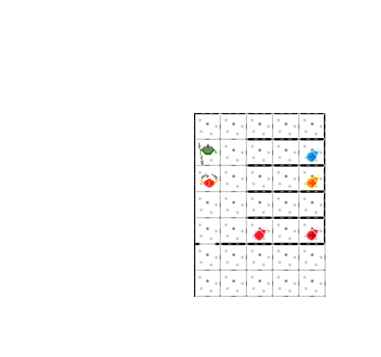

# Escape

### But du jeu

Vous devez sortir du labyrinthe tout en évitant de vous faire tuer par les divers monstres et obstacles qui se mettront en travers de votre route.

### Contrôles

Vous vous déplacez avec les touches directionnelles. Vous pouvez attaquer dans toutes les directions avec ESPACE et faire une attaque chargée avec les touches ZQSD. Votre inventaire est accessible avec la touche I et votre carte avec M.

# Exécution du jeu

Vous devez au préalable avoir installé la librairie pygame et python3.
Pour lancer le jeu vous devez simplement ouvrir le ficher main.py et l'exécuter.
